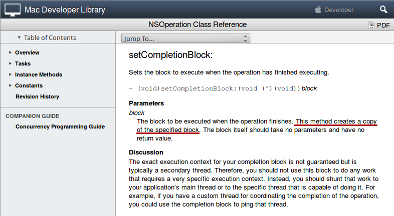

# Asynchronous Programming in iOS

Paul A. Jungwirth

Illuminated Computing

PDX iOS

March 2014

# Restaurant Review App

* Pulls a list of restaurants from our server.
* Runs at app startup, then once an hour.
* The HTTP request via NSURLConnection is asynchronous.
* The hourly requests start from an NSTimer.

https://git@github.com/pjungwir/ios-async-talk-xcode

# With just one thread

* Your app has a "run loop".
* Mostly your app is just sitting there.
* Event callbacks happen on the main loop.
* Everything is one thread, unless you do something special.

# Threading primitives

* atomic operators
* pthread mutexes
* NSLock
* @synchronized(obj) { }
* NSRecursiveLock, NSConditionLock, NSDistributedLock
* NSCondition

.notes With multiple threads, everything becomes unpredictable: "maybe", "could", etc.
.notes Each thread can have its own copy of memory values: memory visibility
.notes So even after thread A writes something, thread B may not see it.
.notes We control this with memory boundaries, formed by locks and other things.

.notes What are each of the above things?

.notes Error-prone
.notes Can result in *slow* code, because too many locks.
.notes Can have deadlocks.

# Deadlock

- Thread A: grab lock A: got it.
- Thread B: grab lock B: got it.
- Thread A: grab lock B: block.
- Thread B: grab lock A: block.

TODO: picture

- Always take locks in the same order.
- Take one big lock.

.notes People spend lots of effort to avoid threads.
.notes Python and Ruby have a GIL, so really there is no parallelism.
.notes Javascript is single-threaded.
.notes Node.js early-on billed async callbacks as easier to learn than threads.
.notes Systems languages need real multi-threading, but they try to provider higher-level abstractions.
.notes Java has an amazing java.util.concurrent.* package.
.notes Objective-C has some things too.

# Higher-Level Alternatives

* GCD: dispatch_async
* NSOperation, NSOperationQueue

TODO: picture

# Rules

* UI updates must happen on the main run loop.
* Must synchronize read/writes to shared data.
* . . . or keep all reads/writes on one thread!

# Our Restaurant App

~~~~~~~~~~~~~~~~~~~~~~~~~~~~~~~~~~~~~~~~~
@@@ objc
// branch: master

@implementation MyAppDelegate {
  NSArray *_restaurants;
}

- (BOOL) application:(UIApplication *)application
  didFinishLaunchingWithOptions:(NSDictionary *)launchOptions {
  [self fetchRestaurants];
}

// . . .

@end
~~~~~~~~~~~~~~~~~~~~~~~~~~~~~~~~~~~~~~~~~

.notes In the old days you had to use retain and release.
.notes Now we have ARC.
.notes But sharing data between threads is tricky.

# With a timer

~~~~~~~~~~~~~~~~~~~~~~~~~~~~~~~~~~~~~~~~~
@@@ objc
// branch: master

- (BOOL) application:(UIApplication *)application
  didFinishLaunchingWithOptions:(NSDictionary *)launchOptions {
  [self fetchRestaurants];

  [NSTimer scheduledTimerWithTimeInterval:60*60
                                   target:self
                                 selector:@selector(fetchRestaurants)
                                 userInfo:nil
                                  repeats:YES];
  // . . .
}
~~~~~~~~~~~~~~~~~~~~~~~~~~~~~~~~~~~~~~~~~

.notes Timers fire on a given run loop.
.notes scheduledTimerWithTimeInterval:target:selector:userInfo:repeats: will fire the timer on the same run loop that you''re on now.
.notes So far everything is just one thread.
.notes The timer's callback is just like any other event, e.g. a touch event.
.notes Even Javascript has timers.

# Sync HTTP Request

~~~~~~~~~~~~~~~~~~~~~~~~~~~~~~~~~~~~~~~~~
@@@ objc
// branch: sync

- (void) fetchRestaurants {
  NSURL *url = [NSURL URLWithString:kAPIRestaurantsURL];
  NSURLRequest *req = [NSURLRequest requestWithURL:url];
  NSURLResponse *resp;
  NSError *err;
  NSData *d = [NSURLConnection sendSynchronousRequest:req
                                  returningResponse:&resp
                                              error:&err];
  if (d) {
    self->_restaurants = [MyRestaurant parseJSON:d];
  }
}
~~~~~~~~~~~~~~~~~~~~~~~~~~~~~~~~~~~~~~~~~

.notes This will block your app
.notes Don''t do it!

# Async HTTP Request

~~~~~~~~~~~~~~~~~~~~~~~~~~~~~~~~~~~~~~~~~
@@@ objc
// branch: async-notification

- (void) fetchRestaurants {
  NSURL *url = [NSURL URLWithString:kAPIRestaurantsURL];
  NSURLRequest *req = [NSURLRequest requestWithURL:url];
  NSOperationQueue *q = [NSOperationQueue mainQueue];
  [NSURLConnection sendAsynchronousRequest:req
                                       queue:q
                             completionHandler:
    ^(NSURLResponse *resp, NSData *d, NSError *err) {
      if (d) {
        self->_restaurants = [MyRestaurant parseJSON:d];
      }
    }];
}
~~~~~~~~~~~~~~~~~~~~~~~~~~~~~~~~~~~~~~~~~

.notes No blocking your app
.notes NSOperationQueue holds a list of TODO items, will process serially.
.notes Each TODO item is an NSOperation, which you can subclass
.notes You can define dependencies between NSOperations.
.notes NSURLConnection handles the internals for us
.notes Our callback runs on the main thread b/c we asked for the main operation queue.

.notes Everyone okay with blocks? Javascript callbacks, C pointers-to-function, Ruby blocks, C# delegates/lambda expressions, Python lambdas
.notes Blocks form closures: they can hold onto outside values in their lexical scope (e.g. the self above).

# Parsing the JSON

~~~~~~~~~~~~~~~~~~~~~~~~~~~~~~~~~~~~~~~~~
@@@ objc
// branch: async-notification

@implementation MyRestaurant {
+ (NSArray *) parseJSON:(NSData *)d {
  NSMutableArray *restaurants = [NSMutableArray new];
  NSError *jsonError = nil;
  NSArray *restFile =
    [NSJSONSerialization JSONObjectWithData:d
                                    options:0
                                      error:&jsonError];
  for (NSDictionary *dict in restFile) {
    MyRestaurant *r = [[MyRestaurant alloc] initWithDictionary:dict];
    [restaurants addObject:r];
  }
  return restaurants;
}
~~~~~~~~~~~~~~~~~~~~~~~~~~~~~~~~~~~~~~~~~

.notes Here is the code to parse the JSON, just in case you''re interested.
.notes Pretty easy, even with no libraries!
.notes NSJSONSerialization requires iOS 5+
.notes What if we want to parse on a background thread also?

# Async parsing with NSOperation

- define an operation to do the parsing
- add it to the queue
- post a notification when done

~~~~~~~~~~~~~~~~~~~~~~~~~~~~~~~~~~~~~~~~~
@@@ objc
// branch: async-notification

@implementation MyParseRestaurantsOperation {
    NSData *_data;
}

- (id)initWithData:(NSData *)d {
    if (self = [super init]) {
        self->_data = d;
        return self;
    }
    return nil;
}

- (void)main {
    self.restaurants = [MyRestaurant parseJSON:self->_data];
    [[NSNotificationCenter defaultCenter]
      postNotificationName:@"ParseRestaurantsOperationFinished"
                                                   object:self];
}

@end
~~~~~~~~~~~~~~~~~~~~~~~~~~~~~~~~~~~~~~~~~

.notes Now we'll launch this operation on a background queue:

# Async parsing with NSOperationQueue
~~~~~~~~~~~~~~~~~~~~~~~~~~~~~~~~~~~~~~~~~
@@@ objc
// MyAppDelegate.m:
// branch: async-notification

- (void)fetchRestaurants {
    NSURL *url = [NSURL URLWithString:kAPIRestaurantsURL];
    NSURLRequest *req = [NSURLRequest requestWithURL:url];
    NSOperationQueue *q = [NSOperationQueue mainQueue];
    [NSURLConnection sendAsynchronousRequest:req
                                       queue:q
                           completionHandler:
     ^(NSURLResponse *resp, NSData *d, NSError *err) {
         if (d) {
             MyParseRestaurantsOperation *op =
               [[MyParseRestaurantsOperation alloc] initWithData:d];
             [[NSNotificationCenter defaultCenter] addObserver:self
                             selector:@selector(parsedRestaurants:)
                          name:@"ParseRestaurantsOperationFinished"
                                                         object:op];
             NSOperationQueue *background = [NSOperationQueue new];
             [background addOperation:op];
         }
     }];
}
~~~~~~~~~~~~~~~~~~~~~~~~~~~~~~~~~~~~~~~~~

.notes Here we are creating a new queue and adding our operation.
.notes Probably we should create the queue once on initialization, not every time.
.notes Now let's look at how we handle the notification.

# Getting an NSNotification from our queue.

~~~~~~~~~~~~~~~~~~~~~~~~~~~~~~~~~~~~~~~~~
@@@ objc
// MyAppDelegate.m:
// branch: async-notification

- (void)parsedRestaurants:(NSNotification *)n {
    [self performSelectorOnMainThread:@selector(updateRestaurants:)
      withObject:((MyParseRestaurantsOperation*)[n object]).restaurants
                                                      waitUntilDone:NO];
}

- (void)updateRestaurants:(NSArray *)restaurants {
    self->_restaurants = restaurants;
    [((MyViewController *)self.window.rootViewController).tableView reloadData];
}
~~~~~~~~~~~~~~~~~~~~~~~~~~~~~~~~~~~~~~~~~

.notes We receive notifications on the same run loop they were posted on.
.notes So we need to "trampoline" to the main run loop.
.notes We use performSelectorOnMainThread for trampolining.

.notes Technically we should also make sure we unregister ourselves from the notification, because NSNotificationCenter only gets a weak reference to us.
.notes But there are easier ways to do all this!

# setCompletionBlock to avoid notifications

~~~~~~~~~~~~~~~~~~~~~~~~~~~~~~~~~~~~~~~~~
@@@ objc
// MyAppDelegate.m:
// branch: async-completion-block

  MyParseRestaurantsOperation *op =
    [[MyParseRestaurantsOperation alloc] initWithData:d];
  [op setCompletionBlock:^{
    [self performSelectorOnMainThread:@selector(updateRestaurants:)
                                          withObject:op.restaurants
                                                  waitUntilDone:NO];
  }];
  NSOperationQueue *background = [NSOperationQueue new];
  [background addOperation:op];
~~~~~~~~~~~~~~~~~~~~~~~~~~~~~~~~~~~~~~~~~

.notes No need for notifications.
.notes The block is called on an unspecified thread, not the main thread.
.notes Still need to trampoline to the main queue to update state and UI.
.notes Oops, a retain cycle!

# Retain Cycles

.notes Retain cycles are the bane of reference-counting memory management.
.notes Object A retains B and B retains A, so neither is ever deallocated.

# Blocks and retain cycles

https://developer.apple.com/videos/wwdc/2011/

* WWDC 2011: Blocks and Grand Central Dispatch in Practice
* WWDC 2011: Objective-C Advancements in Depth

If a block is *copied*, then it retains whatever it closed over.

If you are in turn retaining the block (perhaps indirectly), you have a retain cycle.

Usually it's a problem with `self`.

Watch out closing over _ivars!

.notes To know if a block is copied, check the docs.
.notes XCode might warn you, but it isn't always right.

# setCompletionBlock copies the block

# setCompletionBlock without memory leak

- Close over a weak reference.
- Give the block its own strong reference.
- Make sure the instance didn't disappear in the meantime.

~~~~~~~~~~~~~~~~~~~~~~~~~~~~~~~~~~~~~~~~~
@@@ objc
// MyAppDelegate.m:
// branch: async-completion-block

  MyParseRestaurantsOperation *op =
    [[MyParseRestaurantsOperation alloc] initWithData:d];
  __weak MyParseRestaurantsOperation *weakOp = op;

  [d setCompletionBlock:^{
    MyParseRestaurantsOperation *strongOp = weakOp;
    if (!strongOp) return;
    [self performSelectorOnMainThread:@selector(updateRestaurants:)
                                    withObject:strongOp.restaurants
                                                  waitUntilDone:NO];
  }];
  NSOperationQueue *background = [NSOperationQueue new];
  [background addOperation:op];
~~~~~~~~~~~~~~~~~~~~~~~~~~~~~~~~~~~~~~~~~

.notes This is called the "weak-strong dance", recommended by Apple at WWDC.
.notes We close on the weak reference.
.notes We give ourselves a strong reference so the object doesn't disappear early.
.notes Because we aren't *closing* over strongOp, when it goes out of scope it gets released.

.notes But there is an even cleaner way to do it!

# Block as NSOperation

~~~~~~~~~~~~~~~~~~~~~~~~~~~~~~~~~~~~~~~~~
@@@ objc
// MyAppDelegate.m:
// branch: async-block-as-nsoperation

- (void)fetchRestaurants {
    NSURL *url = [NSURL URLWithString:kAPIRestaurantsURL];
    NSURLRequest *req = [NSURLRequest requestWithURL:url];
    NSOperationQueue *q = [NSOperationQueue mainQueue];
    [NSURLConnection sendAsynchronousRequest:req
                                       queue:q
                           completionHandler:
     ^(NSURLResponse *resp, NSData *d, NSError *err) {
         if (d) {
             NSOperationQueue *background = [NSOperationQueue new];
             [background addOperationWithBlock:^{
                 NSArray *restaurants = [MyRestaurant parseJSON:d];
                 [self performSelectorOnMainThread:@selector(updateRestaurants:)
                                                          withObject:restaurants
                                                               waitUntilDone:NO];
             }];
         }
     }];
}
~~~~~~~~~~~~~~~~~~~~~~~~~~~~~~~~~~~~~~~~~

.notes No need to subclass NSOperation.
.notes But now there's no place to call setCompletionBlock, so back to trampolining.

# Do the NSURLConnection callback on a different queue

~~~~~~~~~~~~~~~~~~~~~~~~~~~~~~~~~~~~~~~~~
@@@ objc
// MyAppDelegate.m:
// branch: async-urlconnection-callback-different-queue

- (void)fetchRestaurants {
    NSURL *url = [NSURL URLWithString:kAPIRestaurantsURL];
    NSURLRequest *req = [NSURLRequest requestWithURL:url];
    NSOperationQueue *q = [NSOperationQueue new];
    [NSURLConnection sendAsynchronousRequest:req
                                       queue:q
                           completionHandler:
     ^(NSURLResponse *resp, NSData *d, NSError *err) {
         if (d) {
             NSArray *restaurants = [MyRestaurant parseJSON:d];
             [self performSelectorOnMainThread:@selector(updateRestaurants:)
                                                      withObject:restaurants
                                                           waitUntilDone:NO];
         }
     }];
}
~~~~~~~~~~~~~~~~~~~~~~~~~~~~~~~~~~~~~~~~~

.notes Note q is no longer the main queue.
.notes Again, no need for separate NSOperation subclass.
.notes Really simple!
.notes Still a hassle to get back onto main thread.

# Async parsing with GCD

Set up a dispatch_queue with GCD:

~~~~~~~~~~~~~~~~~~~~~~~~~~~~~~~~~~~~~~~~~
@@@ objc
@implementation MyAppDelegate {
  NSArray *_restaurants;
  dispatch_queue_t _restaurants_queue;
}

- (BOOL)application:(UIApplication *)application
  didFinishLaunchingWithOptions:(NSDictionary *)launchOptions {
  self->_restaurants_queue = dispatch_queue_create("com.example.restaurants", NULL);
  [self fetchRestaurants];
}
~~~~~~~~~~~~~~~~~~~~~~~~~~~~~~~~~~~~~~~~~

.notes Technically GCD is lower-level than NSOperation.
.notes It makes it easy to do everything in blocks, with no NSOperation subclass.

# Async parsing with GCD

Do our parsing on our own queue:

~~~~~~~~~~~~~~~~~~~~~~~~~~~~~~~~~~~~~~~~~
@@@ objc

- (void)fetchRestaurants {
  NSURL *url = [NSURL URLWithString:kAPIRestaurantsURL];
  NSURLRequest *req = [NSURLRequest requestWithURL:url];
  NSOperationQueue *q = [NSOperationQueue mainQueue];
  [NSURLConnection sendAsynchronousRequest:req
                                     queue:q
                         completionHandler:
    ^(NSURLResponse *resp, NSData *d, NSError *err) {
      if (d) {
        dispatch_async(self->_restaurants_queue, ^{
          NSArray *restaurants = [MyRestaurant parseJSON:d];
          dispatch_async(dispatch_get_main_queue(), ^{
            self->_restaurants = restaurants;
            [((MyViewController *)self.window.rootViewController).tableView reloadData];
          });
        });
      }
    }];
}

~~~~~~~~~~~~~~~~~~~~~~~~~~~~~~~~~~~~~~~~~

.notes Everything is right here: the JSON parsing, the state & UI update.
.notes WWDC 2011 videos mention dispatch_retain/dispatch_release; no need for that with ARC in iOS6+.

# References and Further Reading

* https://developer.apple.com/videos/wwdc/2011/
* http://www.raywenderlich.com/4295/multithreading-and-grand-central-dispatch-on-ios-for-beginners-tutorial
* http://www.raywenderlich.com/19788/how-to-use-nsoperations-and-nsoperationqueues
* http://www.amazon.com/Programming-iOS-7-Matt-Neuburg/dp/1449372341
* https://github.com/pjungwir/ios-async-talk
* https://github.com/pjungwir/ios-async-talk-xcode

# Thanks!

Paul Jungwirth

pj@illuminatedcomputing.com

